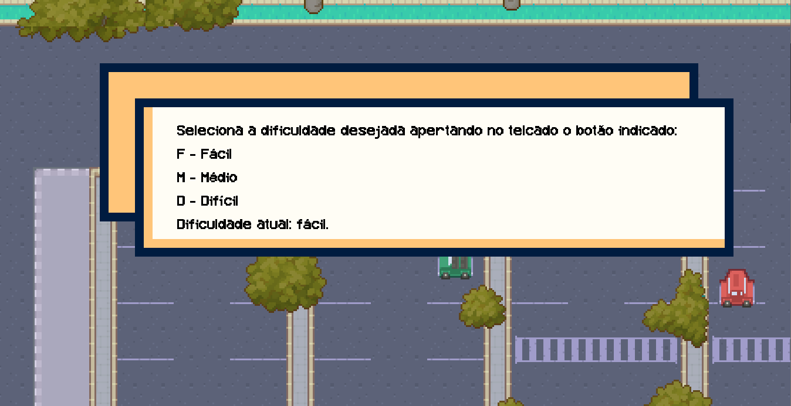

** Relatório da entrega 4 se encontra mais abaixo nesse readme **

# Dungeons and Capybaras

**Autores**:
- Vinicius Batista da Silva @viniciusbsilva
- Vitor Sasaki Venzel @vSasakiv

# O que é este projeto?

**Dungeons and capybaras** é um jogo no estilo RogueLike escrito na linguagem Java, com temática fortemente inspirada na **Universidade de São Paulo**, especialmente na **Escola Politécnica** e seus arredores. O jogo mescla as mecânicas de RPG clássicos com as de combate e exploração em **dungeons**, trazendo uma adaptação ao estilo escolhido.

# Como rodar este projeto?

Comece clonando o repositório para sua máquina local:
```
git clone git@gitlab.uspdigital.usp.br:henrique_eduardo_souza/dungeons-and-capybaras.git
```

Em seguida, abra o diretório do projeto
```
cd dungeons-n-capybaras
```

Compile o jogo, executando o Game.java:
```
javac Game.java
```

Depois, execute o jogo:
```
java Game
```

> Certifique-se de ter em sua máquina uma versão igual ou superior ao java 17.


# Relatório entrega 4

## Requisitos 
5. Utilize o padrão State para criar diferentes dificuldades.

6. Implemente uma música de fundo diferente para cada uma das fases (pode ser dificuldade ou região). Eventos especiais devem ter efeitos sonoros interessantes e agradáveis (cuidado para não tornar o jogo desagradável).

## Adaptações

Diferente das outras entregas, não foram feitas adaptações. Os requisitos foram cumpridos seguindo suas descrições. 

## Requisito 5 - Diferente dificuldades
Usando o padrão State, foram implementadas diferentes dificuldades para o jogo, as quais podem ser selecionadas pelo jogador através de um menu.



O menu pode ser acessado pelo jogador apertando a tecla "ESC" em qualquer localização dos mapas que não são dungeons. Isso implica que, uma vez dentro de uma dungeon, a dificuldade não poderá mudada até que o player saia dela, morrendo ou completando-a. 

As dificuldades implementadas são: fácil, médio e difícil. Elas alteram os atributos dos inimigos que são encontrados nas dungeons, além de mudar os equipamentos do player. 
* Fácil: player equipado com um cajado que dispara bolas de energia que se espalham. Inimigos mais fracos.
* Médio: player equiapdo com um arco que dispara flechas velozes. Inimigos razoáveis.
* Difícil: player equipado com shurikens. Inimigos mais fortes.

## Requisito 6 - Músicas e efeitos sonoros
Músicas de fundo foram adicionadas, alterando de acordo com as duas regiões do jogo: mapa e dungeon. Elas se encaixam ao tema e tocam em loop enquanto o player estiver nessas áreas. 

Além disso, diversos efeitos sonoros foram adicionados e são acionados a partir de diferentes interações. Alguns exemplos são:
* Som ao abrir um menu/caixa de dialogo.
* Som de passos do jogador.
* Som tocado quando o player morre.
* Efeito sonoro de tomar dano.
* Efeito sonoro de disparar projetil.
* Efeito sonoro de matar um inimigo.


## Observações finais

Nessa entrega, o jogador ja é capaz de andar pelo mapa, interagir com npcs, selecionar dificuldades, mudar o estado do player e entrar nas dungeons. Dentro das dungeons, há diversos caminhos e salas com inimigos esperando, os quais devem ser derrotados para que o player possa prosseguir explorando. A mecânica de combate envolve habilidades de esquiva, de mira, reflexo e certa inteligência (como por exemplo, usar paredes ou outros objetos com colisão para se projeter). O jogo está desafiador, exigindo certo tempo e habilidade para que se possa limpar uma dungeon. Diferentes inimigos aparecem em dungeons diferentes, tendo diferentes comportamentos, estados e atributos. 

Recaptulando as outras entregas: 
* O jogo possue mapas inspirados fortemente na USP, principalmente na Escola Politécnica, usando-a como referência para as áreas que não são dungeons e como tema paras dungeons. (Requisito 1).
* O jogador se move livremente pelos mapas, passando pelas localidades através do teclado. Também é capaz de alterar atributos relacionados a isso através da mudança de seu estado, transformando-se em um ninja apertando a tecla "N". (Requisito 2 adaptado).
* As entidades foram implementadas, sendo as principais: NPCs e inimigos. Os NPCs se encontram nos mapas, podendo o jogador interagir com eles apertando "ENTER" fazendo aparecer uma caixa de diálogo. Os inimigos estão presentes nas dungeons e possuem diferentes comportamentos, visuais, estados e atributos. (Requisito 3 adaptado).
* Diferentes "look-and-feel" foram implementados usando padrões como Fábrica e Fábrica Abstrata, os quais são usados para criar espaços para dungeons com temáticas diferentes. As duas implementadas, presente nas duas dungeons, são as temáticas de "Biênio" e de "Elétrica", inspiradas nos departamentos da Poli. (Requisito 4).
* O padrão State foi utilizado para implementar 3 dificuldades diferentes, as quais alteram atributos dos inimigos e os equipamentos do player dentro das dungeons. (Requisito 5).
* Há diferentes músicas de fundo para duas regiões (mapas e dungeons), além de efeitos sonoros distintos para difentes tipos de interações presentes no jogo. (Requisito 6).

Os relatórios das outras entregas, os quais possuem outros detalhamentos, podem ser encontrados na pasta "docs", presente na raiz do projeto. Com o exposto, acredita-se que todos os requisitos foram cumpridos de maneira satisfatória, considerando a adaptação temática do jogo para um do tipo "roguelike" parecido com o Soul Knight. Obrigado, e aproveitem o jogo! 