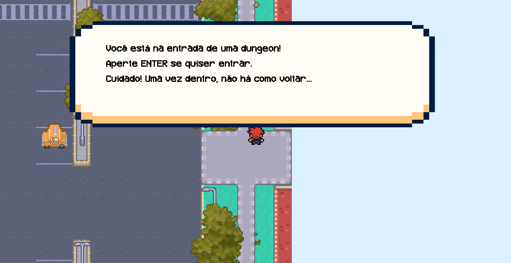
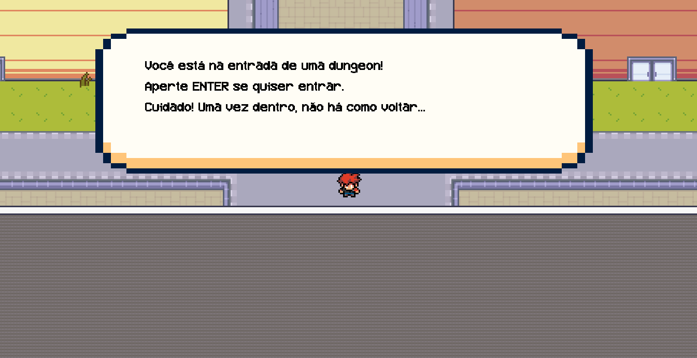
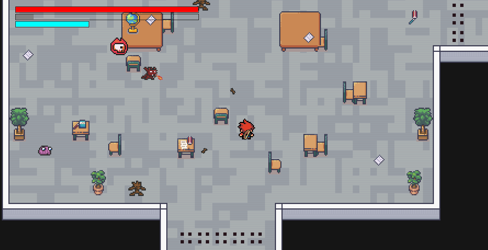
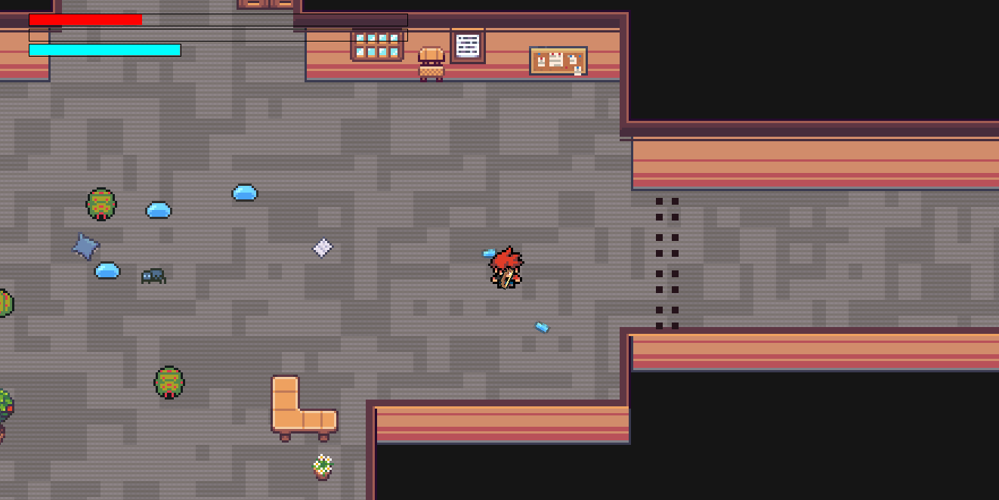
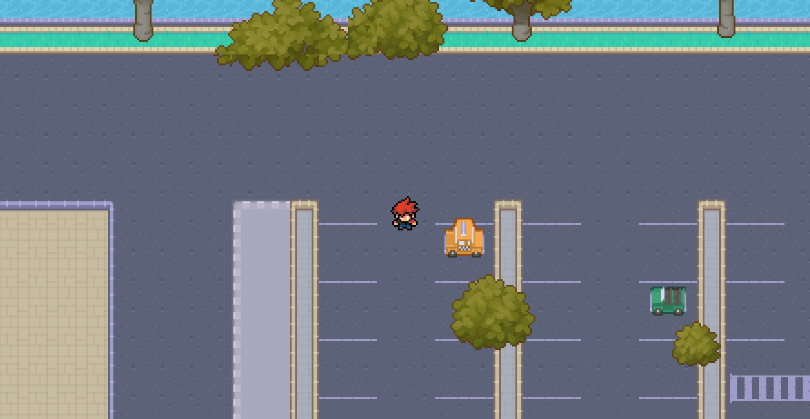
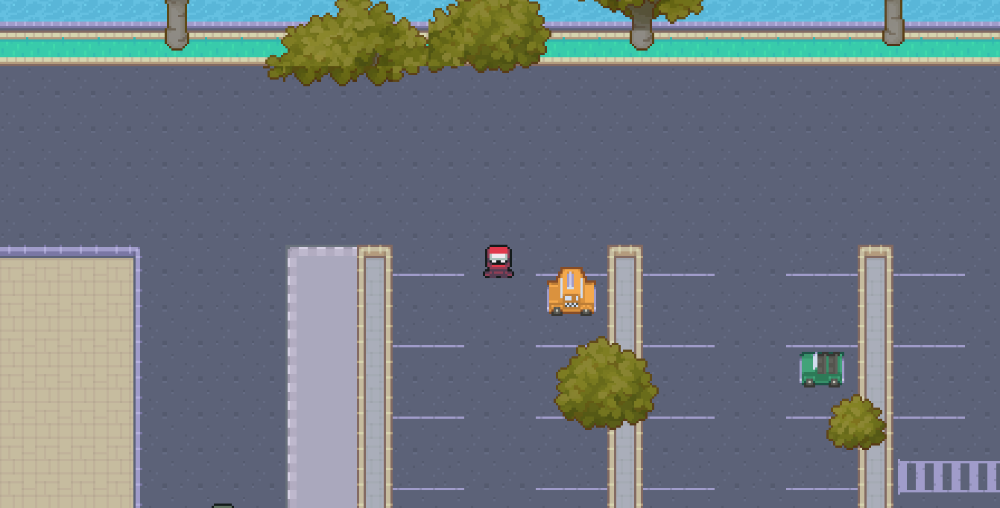
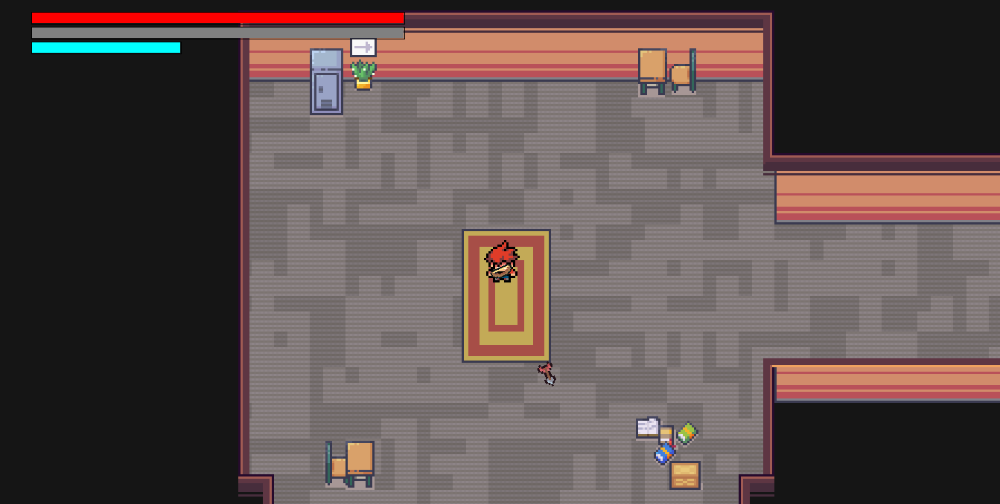

** Relatório da entrega 3 se encontra mais abaixo nesse readme **

# Dungeons and Capybaras

**Autores**:
- Vinicius Batista da Silva @viniciusbsilva
- Vitor Sasaki Venzel @vSasakiv

# O que é este projeto?

**Dungeons and capybaras** é um jogo no estilo RogueLike escrito na linguagem Java, com temática fortemente inspirada na **Universidade de São Paulo**, especialmente na **Escola Politécnica** e seus arredores. O jogo mescla as mecânicas de RPG clássicos com as de combate e exploração em **dungeons**, trazendo uma adaptação ao estilo escolhido.

# Como rodar este projeto?

Comece clonando o repositório para sua máquina local:
```
git clone git@gitlab.uspdigital.usp.br:henrique_eduardo_souza/dungeons-and-capybaras.git
```

Em seguida, abra o diretório do projeto
```
cd dungeons-n-capybaras
```

Compile o jogo, executando o Game.java:
```
javac Game.java
```

Depois, execute o jogo:
```
java Game
```

> Certifique-se de ter em sua máquina uma versão igual ou superior ao java 17.


# Relatório entrega 3

## Requisitos 
3.  A raia deverá ser populada por estudantes NPCs da POLI. Use a raia, a
rua e as ciclofaixas como ambientes para diferentes tipos de Polimons. Vocês
são livres para decidir se eles serão visíveis ou invisíveis, mas algo deve acontecer quando houver a colisão entre personagem e Polimon.
Utilize o padrão Strategy para definir diferentes comportamentos para os
Polimons e NPCs. O usuário poderá escolher uma estratégia ou outra por meio
da interface gráfica do jogo.

4. Utilizando o padrão Fábrica Abstrata, implemente a possibilidade
do jogo ter diferentes aparências (look-and-feel). Assim, facilmente, o jogador
poderá escolher se o espaço do jogo terá: (A) uma aparência da POLI (B) aparência do IME etc (vocês tem liberdade para escolher as variantes que vão implementar, mas precisam especificar pelo menos duas).

## Adaptações

Conforme proposto inicialmente, o jogo desenvolvido nesse projeto não seguiria a implementação de um jogo inspirado em pokemon, mas sim em rogue-like. Foram implementados os padrões de projeto e os princípios de POO dos requisitos em outros aspectos, os quais serão comentados mais adiante. 

* As entidades como NPC e, principalmente, os monstros foram implementadas na ja entrega 2. Pode-se encontrar o relatório da entrega 2 na pasta "docs". O padrão strategy foi implementado tanto para alterar comportamentos de entidades quanto para outros contextos.  Não faz sentido, no contexto desse jogo, o player poder escolher as estratégias das outras entidades.

* O padrão fábrica foi utilizado mais de uma vez no projeto. No sentido de ter diferentes aparências (look-and-feel), a implementação foi feita através dos diferentes estilos de dungeons que estão disponíveis. 

Com essas adaptações, acreditamos que os requisitos são atendidos com implementações análogas às propostas. 

## Mapas
No estado atual do jogo, existem 2 mapas: estacionamento principal da Poli e estacionamento do Biênio, sendo esses dois fortemente inspirados na USP. Além disso, há duas dungeons, uma inspirada no Biênio e outra no departamento da Elétrica. Todos os mapas podem ser explorados se movimentando pelas teclas W, A, S e D do teclado. 

1. Estacionamento principal 
    
    Área inicial do player quando o jogo é aberto, inspirada no estacionamento localizado na parte central da Escola Politécnica. O player pode caminhar entre as ruas e calçadas e verificar toda paisagem. 
    
    Existem duas áreas que levam para outros mapas:

    * Entrada do prédio vermelho, localizado à direita do mapa. Ao se dirigir à entrada do prédio, o player será redirecionado a uma dungeon com estilo inspirado no departamento da Elétrica. 
    
    * Próximo ao canto inferior esquerdo, na rua que leva para uma parte de fora do mapa. O jogador que atravessar essa área será levado para o estacionamento do Biênio.
    


2. Estacionamento do Biênio  
    Área inspirada na área de estacionamento que fica entre o Biênio e o prédio da Engenharia Civil. O jogador pode andar pelas ruas, calçadas, grama e visitar o vão do Biênio. 

    Existe duas áreas que leva para outros mapas:
    
    * Na parte superior, ao lado esquerda da área verde e direito do prédio vermelho (Eng. Civil), há uma rua que leva para uma parte fora do mapa. Se o player atravessar essa área no topo, será redirecionado para estacionamento principal. 
    
    * Na parte inferior esquerda, na área atrás do prédio inspirado nos anfiteatros amarelo e vermelho, há a entrada de um prédio, a qual levará o player para a dungeon inspirada no Biênio.
    

3. Dungeons
    Existem duas dungeons atualmente implementadas no jogo, as quais podem ser acessadas por entradas de prédios nos mapas anteriores. As dungeons são geradas aleatoriamente, conectando salas e corredores de forma diferente toda vez que é gerada. 

    As dungeons compartilham o mesmo sistema. O padrão fábrica abstrata foi usado para implementar diferentes aparências para as dungeons, de forma a possibilitar a alteração de estilos - Biênio e Elétrica - criando objetos com sprites de cada uma das temáticas. 

    No estado atual do jogo, as dungeons apenas são geradas e ainda não possuem todas as mecânicas pertinentes. O objetivo principal da entrega é implementar diferentes variantes de dungeons através do método fábrica. 

    Dungeon Biênio:
    

    Dungeon Elétrica:
    

    OBS: As dungeons foram somente inspiradas nos locais reais apenas tematicamente. Pelo jogo ser um rogue-like que possui um sistema de combate - violento - não é pertinente e correto representar os lugares fielmente. No contexto, os prédios foram invadidos por monstros e o player precisa resolver esse problema.

## NPCs
Atualmente o jogo não está populado por NPCs, apesar de ja estarem implementados. Um NPC exemplo foi posto no mapa inicial (Estacionamento principal). Para interagir com ele, basta se aproximar e apertar a tecla "enter". Quando fizer isso, uma caixa de diálogo irá aparecer.

Exemplo atualmente implementado: 
 


## Diferentes comportamentos

Atualmente, há dois comportamentos, além do padrão, para o player que podem ser acessados com diferentes interações em diferentes lugares. Um deles está relacionado ao combate e outro ao modo de exploração. 

1. Padrão: o player inicialmente está em um mapa de exploração, fortemente baseado na USP. Ele pode apenas andar e explorar o mapa, indo para lugares diferentes acessando outras áreas. Pode alternar para o modo ninja apertando a tecla "n" do teclado.


2. Ninja: em um mapa de exploração, assume forma de um ninja que anda rapidamente e pode passar de forma veloz pelos lugares do mapa. Pode alternar para o modo padrão apertando a tecla "n" do teclado.


3. Combate: ao entrar em um mapa de dungeon , o player equipa uma arma e agora pode atirar com ela. Agora ele também possui barras de vida (vermelha) e armadura (cinza), que podem diminuir caso seja atingido por projéteis de monstros. Sempre que estiver em uma dungeon, o player permanece nesse modo sem poder mudar para o padrão ou para o ninja. 



## Implementação de padrões 
 * O padrão Factory foi implementado para criar os diferentes sprites usados pelo player de mapa (MapPlayer). 
 * O padrão Factory também foi utilizado para criação de diferentes tipos de projéteis que podem ser disparados pelas armas. Isso foi melhor apresentado na entrega 2. 
 * Acerca dos sprites utilizados em diversas entidades, o padrão Strategy foi implementado para isolar o algoritmo que carrega as imagens para cada caso.
 * O padrão Strategy foi usado em conjunto com a noção de estados para alterar comportamentos de entidades como NPCs e "enemy", alterando entre comportamentos como o de patrulha.
 * O padrão State foi implementado para mudar o estado do jogo em diferentes mapas. A classe intermediadora "GameState" altera o estado do game entre: mapa, dungeon e dialogo. No "mapa", há NPCs, não há combate e tem mapas específicos. Em "dungeon", o comportamento do player muda e há combate. Por fim, em "dialogo" o game pausa e é mostrada uma janela de dialogo.
 * O Strategy foi novamente utilizado através da interface "Draw", implementada por diferentes classes que possuem diferentes algoritmos para renderizar as imagens na janela do jogo.
 * Por fim, mais um Strategy foi feito para implementar algoritmos diferentes que decidem como que ocorre as mudanças de mapa. A classe abstrata "ChangeTileStrategy" é aquela da qual se as implementações concretas herdam. 


## Observações finais

Nessa entrega, o jogador prioritariamente apenas anda pelos mapas. A implementação do combate está nos estágios intermediários, apresentando atualmente apenas uma noção do sistema que irá vir futuramente. 

Os mapas possuem "bordas de mundo" visíveis, porém não acessíveis, ao jogador. Vale destacar que em entregas futuras os mapas serão estendidos/incrementados e o sistema de câmera do mundo aprimorado, para evitar/amenizar esse problema. 

Alguns funcionalidades foram implementadas mas não estão presentes no estado atual do jogo. Elas serão readicionadas assim que o sistema das dungeons estiver mais consistente. Algumas delas são: NPCs, inimigos, combate e as diferentes armas. Algumas dessas coisas foram melhor exploradas na entrega 2.

Com a presença de NPCs, os quais possibilitam interação, com a implementação do padrão Strategy em diferentes contextos e com a utilização do padrão Fábrica Abstrata para alterar as aparências das dungeons, os requisitos da entrega atual foram atingidos. 
