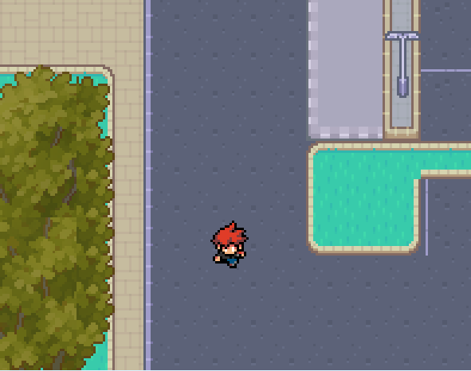
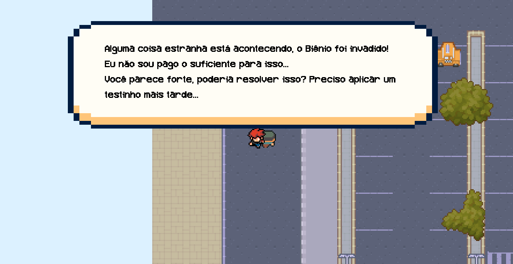
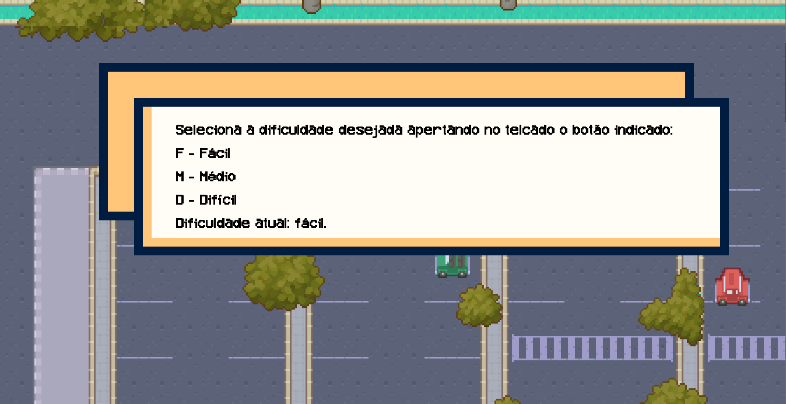

# Dungeons and Capybaras

**Autores**:
- Vinicius Batista da Silva @viniciusbsilva
- Vitor Sasaki Venzel @vSasakiv

# O que é este projeto?

**Dungeons and capybaras** é um jogo no estilo RogueLike escrito na linguagem Java, com temática fortemente inspirada na **Universidade de São Paulo**, especialmente na **Escola Politécnica** e seus arredores. O jogo mescla as mecânicas de RPG clássicos com as de combate e exploração em **dungeons**, trazendo uma adaptação ao estilo escolhido.

# Como rodar este projeto?

Comece clonando o repositório para sua máquina local:
```
git clone git@gitlab.uspdigital.usp.br:henrique_eduardo_souza/dungeons-and-capybaras.git
```

Em seguida, abra o diretório do projeto
```
cd dungeons-n-capybaras
```

Compile o jogo, executando o Game.java:
```
javac Game.java
```

Depois, execute o jogo:
```
java Game
```

> Certifique-se de ter em sua máquina uma versão igual ou superior ao java 17.


## Mapas
No estado atual do jogo, existem 2 mapas: Estacionamento Principal da Poli e Estacionamento do Biênio, sendo esses dois fortemente inspirados na USP. Além disso, há duas dungeons, uma inspirada no Biênio e outra no departamento da Elétrica. Todos os mapas podem ser explorados se movimentando pelas teclas W, A, S e D do teclado. 

1. Estacionamento principal 
    
    Área inicial do player quando o jogo é aberto, inspirada no estacionamento localizado na parte central da Escola Politécnica. O player pode caminhar entre as ruas e calçadas e verificar toda paisagem. 
    
    Existem duas áreas que levam para outros mapas:

    * Entrada do prédio vermelho, localizado à direita do mapa. Ao se dirigir à entrada do prédio, o player será redirecionado a uma dungeon com estilo inspirado no departamento da Elétrica. 
    
    * Próximo ao canto inferior esquerdo, na rua que leva para uma parte de fora do mapa. O jogador que atravessar essa área será levado para o estacionamento do Biênio.
    


2. Estacionamento do Biênio  
    Área inspirada na área de estacionamento que fica entre o Biênio e o prédio da Engenharia Civil. O jogador pode andar pelas ruas, calçadas, grama e visitar o vão do Biênio. 

    Existem duas áreas que levam para outros mapas:
    
    * Na parte superior, ao lado esquerdo da área verde e direito do prédio vermelho (Eng. Civil), há uma rua que leva para uma parte fora do mapa. Se o player atravessar essa área no topo, será redirecionado para Estacionamento Principal. 
    
    * Na parte inferior esquerda, na área atrás do prédio inspirado nos anfiteatros amarelo e vermelho, há a entrada de um prédio, a qual levará o player para a dungeon inspirada no Biênio.
    

3. Dungeons

    Existem duas dungeons atualmente implementadas no jogo, as quais podem ser acessadas por entradas de prédios nos mapas anteriores. As dungeons são geradas aleatoriamente, conectando salas e corredores de forma diferente toda vez que é gerada. 

    As dungeons compartilham o mesmo sistema. O padrão fábrica abstrata foi usado para implementar diferentes aparências para as dungeons, de forma a possibilitar a alteração de estilos - Biênio e Elétrica - criando objetos com sprites de cada uma das temáticas. 


    Dungeon Biênio:
    

    Dungeon Elétrica:
    

    OBS: As dungeons foram somente inspiradas nos locais reais apenas tematicamente. Pelo jogo ser um rogue-like que possui um sistema de combate - violento - não é pertinente e correto representar os lugares fielmente. No contexto, os prédios foram invadidos por monstros e o player precisa resolver esse problema.


## Interações importantes
### NPCs
Alguns NPCs estão presentes nas áreas fora das dungeons. Para interagir com eles, basta se aproximar e apertar a tecla "ENTER". Quando fizer isso, uma caixa de diálogo irá aparecer.

 

### Menu de dificuldades
É possível alterar a dificuldade das dungeons através do menu de dificuldades. Para acessá-lo, basta apertar a tecla "ESC" em qualquer lugar das áreas fora das dungeons. Um menu irá aparecer pedindo para você apertar F, M ou D para selecionar uma dificuldade. A dificuldade atualmente em curso será explicitada nesse menu. Para sair dele, bastar apertar "ESC" novamente.



### Entrada das dungeons
Ao se aproximar de uma entrada de uma dungeon, uma caixa de diálogo aparecerá alertando o player. Caso o player aperte e tecla "ENTER" quando essa caixa de diálogo aparecer, ele será redirecionado para uma dungeon. Uma vez dentro, o jogador só voltará para área de fora se morrer la dentro ou se completar toda a dungeon. 


## Diferentes comportamentos

Atualmente, há dois comportamentos, além do padrão, para o player que podem ser acessados com diferentes interações em diferentes lugares. Um deles está relacionado ao combate e outro ao modo de exploração. 

1. Padrão: o player inicialmente está em um mapa de exploração, fortemente baseado na USP. Ele pode apenas andar e explorar o mapa, indo para lugares diferentes acessando outras áreas. Pode alternar para o modo ninja apertando a tecla "N" do teclado.


2. Ninja: em um mapa de exploração, assume forma de um ninja que anda rapidamente e pode passar de forma veloz pelos lugares do mapa. Pode alternar para o modo padrão apertando a tecla "N" do teclado.


3. Combate: ao entrar em um mapa de dungeon , o player equipa uma arma e agora pode atirar com ela. Agora ele também possui barras de vida (vermelha) e armadura (cinza), que podem diminuir caso seja atingido por projéteis de monstros. Sempre que estiver em uma dungeon, o player permanece nesse modo sem poder mudar para o padrão ou para o ninja. 


## Dungeons 

Há duas dungeons, as quais os locais de acesso ja foram mencionados. Todas as dungeons são geradas conectando diferentes salas através de corredores, em um algoritmo que sempre gera dungeons distintas. O player, ao entrar nela, inicia em uma pequena sala neutra e pode escolher algum caminho a seguir. O seu objetivo é passar pelas salas e eliminar todos os inimigos que invadiram os locais. 

Ao entrar em uma sala ainda não limpa, o espinhos surgem prendendo o player nela, sendo só possível prosseguir para a próxima depois que todos os inimigos forem eliminados. Os monstros aparecem seguindo um sistema de "waves", no qual uma certa quantidade de monstros aparecem por vez. Ao final de uma wave, o jogador escutará um efeito sonoro e a próxima começará. No termino das waves, os espinhos somem e o jogador é liberado para continuar explorando. 

Os inimigos possuem comportamentos, visuais e estados diferentes. Normalmente, apenas patrulham a área. Quando avistam o player, entram em um dos dois modos de batalha: passivo, no qual foge do player e ataca de longe, e agressivo, no qual ele corre em direção ao player. Eles possuem atributos diferentes dependendo do tipo de inimigo e da dificuldade escolhida. O combate envolve prioritariamente o disparo de projéteis. Porém é possível dar e receber dano ao encostar nos inimigos.

Em uma dungeon, o player tem duas barras de atributos: a vida e a armadura. Sempre que o jogador tomar dano, algumas dessas barras diminuirá. Sempre que houver armadura, ela será a primeira que receberá o dano. Quando a barra de vida sumir - chegar ao 0 - o jogador morrerá, saindo da dungeon e aparecendo na área de fora. Caso o jogador passe certo tempo sem levar dano, a barra de armadura se regenera, porém a de vida não. O player precisa tomar cuidado, evitar tomar dano na vida e sempre manter sua armadura.  

Ao passar por todas as salas, livrando o local de todos os inimigos que o invadiram, o player terá conquistado a dungeon e será redirecionado para a área de fora. 

Exemplo de gameplay:
[](https://youtu.be/D-t1gC3FP48)
